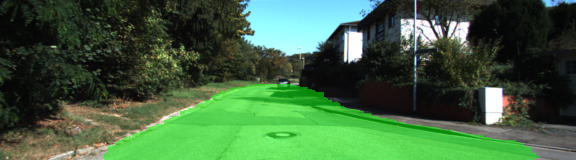
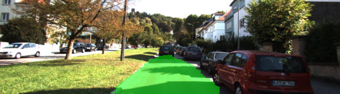
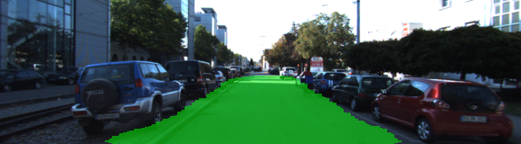

# CarND Semantic Segmentation Project

 Semantic segmentation project in the Udacity's Self-Driving Car NanoDegree. The original project template can be found [here](https://github.com/udacity/CarND-Semantic-Segmentation).

## The project task

In this project the goal is to label the pixels of a road in images using a Fully Convolutional Network (FCN). The neural network has to be trained on a machine with a GPU, e.g. an AWS instance or using Udacity workspace with GPU enabled. 

Here are examples of a sufficient vs. insufficient output from a trained network:

Sufficient Result          |  Insufficient Result
:-------------------------:|:-------------------------:
  |  

## Implementation summary

The main script in the project is `main.py`. Then invoked, it trains the neural network and prepares the output images with labeled road pixels. The logic for the model construction is implemented in the `functions` module:

 * `load_vgg_graph` loads the original VGG16 model as a TensorFlow graph
 * `load_vgg` loads the VGG16 and extracts the references to the tensors of interest
 * `layers` creates the decoder part of the fully-convolutional network
 * `upsample_layer`  is used in `layers` to upsample a single layer
 * `optimize` creates TensorFlow loss and optimizer operations
 * `optimize_reg` does the same as `optimize`, but with adding the regularization to the loss
 * `add_regularization` realizes the regularization factor with respect to the weights of the decoder layers of the FCN
 * `train_nn` trains the neural network
 * `save_model_sm` saves the trained model in the `tf.saved_model` format
 * `save_model_saver` saves the trained model with `tf.train.Saver()`

Here are some examples of the resulting labeled images:

 

 

 

---

## Dependencies

 - [Python 3](https://www.python.org/)
 - [TensorFlow](https://www.tensorflow.org/)
 - [NumPy](http://www.numpy.org/)
 - [SciPy](https://www.scipy.org/)
 - [Python Image Library (PIL)](https://pillow.readthedocs.io/) (for SciPy's `imresize` function)

## Dataset

Download the [Kitti Road dataset](http://www.cvlibs.net/datasets/kitti/eval_road.php) from [here](http://www.cvlibs.net/download.php?file=data_road.zip).  Extract the dataset in the `data` folder.  This will create the folder `data_road` with all the training a test images.
 
## Implementation/submission guidelines and tips

Implementation:

Implement the code in the `main.py` module (functions `load_vgg`, `layers`, `optimize`, `train_nn`, in this repositiry part of the `functions` module) indicated by the "TODO" comments. The comments indicated with "OPTIONAL" tag are not required to complete.

Submission:

1. Ensure you've passed all the unit tests.
2. Ensure you pass all points on [the rubric](https://review.udacity.com/#!/rubrics/989/view).
3. Submit the following in a zip file.
     - `helper.py`
     - `main.py`
     - `project_tests.py`
     - Newest inference images from `runs` folder  (all images from the most recent run)

Tips:

- The link for the frozen `VGG16` model is hardcoded into `helper.py`.  The model can be found [here](https://s3-us-west-1.amazonaws.com/udacity-selfdrivingcar/vgg.zip).
- The model is not vanilla `VGG16`, but a fully convolutional version, which already contains the 1x1 convolutions to replace the fully connected layers. Please see this [post](https://s3-us-west-1.amazonaws.com/udacity-selfdrivingcar/forum_archive/Semantic_Segmentation_advice.pdf) for more information.  A summary of additional points, follow. 
- The original FCN-8s was trained in stages. The authors later uploaded a version that was trained all at once to their GitHub repo.  The version in the GitHub repo has one important difference: The outputs of pooling layers 3 and 4 are scaled before they are fed into the 1x1 convolutions.  As a result, some students have found that the model learns much better with the scaling layers included. The model may not converge substantially faster, but may reach a higher IoU and accuracy. 
- When adding l2-regularization, setting a regularizer in the arguments of the `tf.layers` is not enough. Regularization loss terms must be manually added to your loss function. otherwise regularization is not implemented.

### Why Layer 3, 4 and 7?
In `main.py`, you'll notice that layers 3, 4 and 7 of VGG16 are utilized in creating skip layers for a fully convolutional network. The reasons for this are contained in the paper [Fully Convolutional Networks for Semantic Segmentation](https://arxiv.org/pdf/1605.06211.pdf).

In section 4.3, and further under header "Skip Architectures for Segmentation" and Figure 3, they note these provided for 8x, 16x and 32x upsampling, respectively. Using each of these in their FCN-8s was the most effective architecture they found. 

### Optional sections
Within `main.py`, there are a few optional sections you can also choose to implement, but are not required for the project.

1. Train and perform inference on the [Cityscapes Dataset](https://www.cityscapes-dataset.com/). Note that the `project_tests.py` is not currently set up to also unit test for this alternate dataset, and `helper.py` will also need alterations, along with changing `num_classes` and `input_shape` in `main.py`. Cityscapes is a much more extensive dataset, with segmentation of 30 different classes (compared to road vs. not road on KITTI) on either 5,000 finely annotated images or 20,000 coarsely annotated images.
2. Add image augmentation. You can use some of the augmentation techniques you may have used on Traffic Sign Classification or Behavioral Cloning, or look into additional methods for more robust training!
3. Apply the trained model to a video. This project only involves performing inference on a set of test images, but you can also try to utilize it on a full video.
